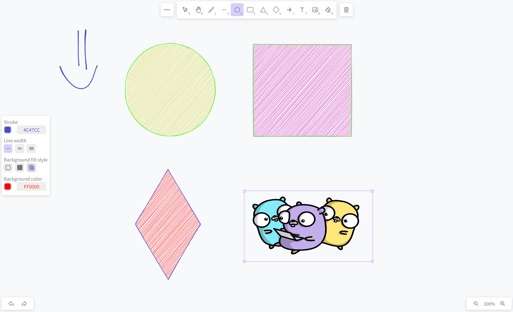

# React drawboard
**Live at**: [:globe_with_meridians: https://paint.dezzerlol.tech/](https://paint.dezzerlol.tech/)

### Made with:
- react
- vite
- typescript
- rough.js
- perfect-freehand
- zustand
- @radix-ui

### Features:
  - [x] Pencil drawings
  - [x] Different elements (circle, rectangle, triangle, rhombus, arrow, text, image)
  - [x] Drawing settings (line color, line width, background fill style, etc.)
  - [x] Adaptive design
  - [x] Zoom and panning on the canvas
  - [x] Export drawings as json
  - [x] Undo/redo  
  - [x] i18n (ru, en)
  - [x] Export drawings as image
  - [ ] Collaboration
  - [ ] Tests
  
